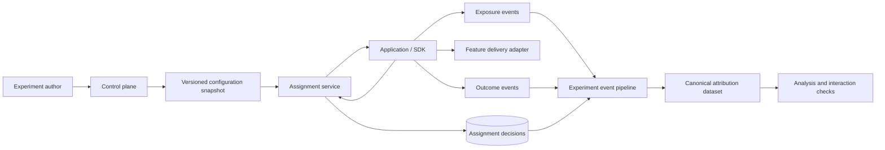

# Layered Experimentation

A domain-agnostic specification and reference design for running concurrent experiments across product and technical decision points without losing assignment stability, causal provenance, or operational control.

## Status

**Specification-first.** This repository currently defines the problem, requirements, architecture, event contracts, and implementation roadmap. A .NET reference implementation is intended to follow after the design is reviewed.

## Why this exists

Feature-flag systems are useful for delivering features, but they become difficult to govern when they also own experimental assignment, eligibility, mutual exclusion, treatment selection, and outcome attribution.

This project separates those concerns:

- an **experimentation service** owns eligibility, allocation, assignment history, layer conflicts, and provenance;
- feature delivery systems may consume the chosen treatment but do not rebucket subjects;
- assignment, actual exposure, applied effects, and later outcomes are independently recorded;
- adding or removing one experiment does not silently reshuffle unrelated experiments;
- overlapping experiments are explicit, validated, and visible in analysis data.

## Core concepts

- **Unit:** the typed entity randomized by an experiment, such as a user, session, account, transaction, device, request, or composite key.
- **Layer:** a meaningful decision point or influence boundary.
- **Effect:** a named aspect of behaviour an experiment may change.
- **Allocation namespace:** a mutually exclusive traffic/subject pool within a layer.
- **Compatibility rule:** an explicit declaration allowing or prohibiting overlap.
- **Assignment:** the immutable decision that a unit belongs to a treatment.
- **Exposure:** evidence that the treatment actually influenced behaviour.
- **Applied effect:** the concrete values or components used by the application.
- **Outcome:** a later observable event that can be joined to assignment and exposure context.

## Proposed shape

## Documents

- [Full specification](docs/specification.md)
- [Architecture and data contracts](docs/architecture.md)
- [Research basis](docs/research.md)
- [Specification review and readiness gate](docs/review.md)
- [Migration from feature-flag-owned assignment](docs/migration-from-feature-flags.md)
- [Generic worked example](examples/layered-experiment.yaml)
- [Architecture decisions](docs/adr/)

## Deliberate scope boundary

The first version standardises experiment definition, assignment, exposure, provenance, conflict safety, and canonical data export. It does **not** attempt to become a complete statistical analysis platform, feature-flag vendor, workflow suite, or domain-specific decision engine.

## Design principles

1. Assignment is deterministic, versioned, and explainable.
2. Exposure is not inferred from assignment.
3. Applied behaviour is recorded, not reconstructed from mutable configuration.
4. Layers model influence; allocation namespaces model mutual exclusion.
5. Compatibility is explicit and validated before publication.
6. Existing allocations do not move when unrelated experiments are added or removed.
7. Interaction context travels with exposure and outcomes.
8. Failure behaviour is declared per layer or experiment and always has a safe default.
9. The common path should require a small SDK call, not bespoke bucketing code.
10. Feature delivery is downstream of assignment.

## Repository safety

The specification is intentionally generic. Examples use fictional domains and contain no proprietary platform details, credentials, production topology, customer data, or organisation-specific rules.

## License

MIT. See [LICENSE](LICENSE).
