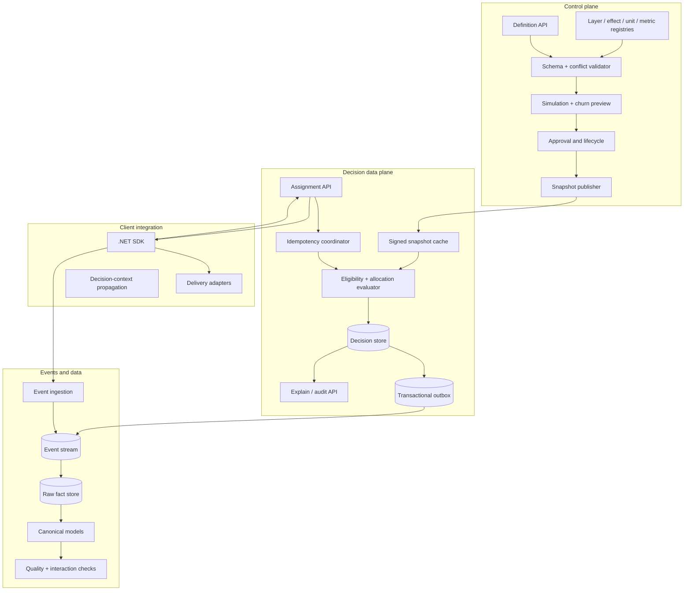

# Architecture and data contracts

## Status

**Proposed.** This document makes the specification concrete enough to prototype. Storage, event transport, SLOs, and authorisation remain decision gates before production.

[Correctness contracts](correctness-contracts.md) are normative for revision/epoch separation, configuration/revocation consistency, assignment uniqueness, context lineage, event idempotency, effect composition, privacy, and deletion.

## 1. Architecture principles

1. **Central authority, bounded local resilience.** The service owns definitions and authoritative first decisions; signed snapshots support cached reuse and only explicitly leased local-first modes with reconciliation and revocation bounds.
2. **Immutable inputs to deterministic decisions.** Definitions, algorithms, canonical serialization, and assignment epochs are versioned.
3. **Facts before derived interpretation.** Assignment, exposure, applied effect, unit relationship, and outcome are immutable-by-default facts with linked corrections and explicit lawful-erasure semantics. Attribution is a versioned derived view.
4. **Conflict prevention before analysis.** The control plane rejects deterministic conflicts; data products reveal allowed or unknown interactions.
5. **No ambient experiment state.** A decision-context token is explicitly propagated through calls and events.
6. **No silent rebucketing.** Allocation-map changes produce a churn preview; unrelated active allocations are invariant.
7. **Feature delivery is downstream.** Delivery adapters receive the selected treatment and report what was applied.

## 2. Logical components



### 2.1 Control plane

Responsible for authoring, validation, approval, lifecycle, slot allocation, immutable revision publication, and configuration distribution.

It is not on the synchronous assignment path except through published snapshots.

### 2.2 Assignment service

Responsible for:

- canonicalising units and context;
- loading a single immutable snapshot revision;
- evaluating eligibility;
- selecting namespace slot ownership;
- applying exclusions and compatibility rules;
- selecting variants;
- persisting an idempotent decision set;
- returning treatments, reason codes, and context token;
- emitting decision events through a transactional outbox.

### 2.3 SDK

The .NET SDK provides:

```csharp
DecisionSet decision = await experiments.DecideAsync(
    decisionPoint: "checkout",
    units: Units.Of("account", accountId),
    context: new { country, channel },
    idempotencyKey: operationId,
    cancellationToken);

using var scope = decision.BeginContext();

// Use treatment directly or send it to a delivery adapter.
var experience = decision.Get<CheckoutExperience>("checkout-sequence");

await experiments.ExposeAsync(
    decision,
    exposurePoint: "checkout.rendered",
    appliedEffects: effects,
    cancellationToken);
```

The SDK must not hide the difference between a decision and exposure. An optional `DecideAndExposeAsync` is permitted only for effect points where treatment use is guaranteed by successful return.

### 2.4 Event/data plane

Accepts immutable-by-default facts, validates envelopes, deduplicates by scoped event ID/fingerprint, records linked corrections or lawful-erasure tombstones, and produces canonical datasets. It does not mutate historical assignments to match current configuration.

## 3. Control-plane model

### 3.1 Registry entities

#### Unit type

```yaml
id: account
kind: scalar
idFormat: opaque-string
classification: pseudonymous
allowedEligibilityAttributes:
  - country
  - channel
```

Composite unit types specify ordered component types. Canonical order is part of the registered schema.

#### Layer

```yaml
id: checkout
owner: team-checkout
allowedUnitTypes: [account, session]
effects:
  - checkout.sequence
  - checkout.copy
  - checkout.recommendation.model
defaultFailurePolicy: safe-default
```

#### Allocation namespace

```yaml
id: checkout-primary
layer: checkout
randomisationUnit: account
slotCount: 10000
assignmentAlgorithm: hash-slot-v1
namespacePartitionEpoch: 1
allocationMapRevision: 1
```

Slot count and canonical hash algorithm are immutable within a namespace partition epoch. A namespace binds exactly one randomisation unit type; experiments using another unit type require another namespace and explicit overlap analysis. Without that rule, “mutual exclusion” across unrelated IDs would be false.

#### Effect

```yaml
id: checkout.copy
allowedModes: [replace]
classification: public-config
```

A registered reducer is required for modes other than `replace`.

### 3.2 Experiment definition

```yaml
id: checkout-layout-2026-01
definitionRevision: 1
analysisRevision: 1
status: draft
owner: team-checkout
hypothesis: A shorter sequence improves completion without increasing support contacts.
layer: checkout
allocationNamespace: checkout-primary
randomisationUnit: account
assignmentEpoch: 1
eligibility:
  all:
    - attribute: country
      operator: in
      value: [AU, NZ]
slotAllocation:
  slots: [1000-1499]
variants:
  - id: control
    weight: 0.5
    effects:
      checkout.sequence:
        mode: replace
        valueRef: checkout-v2
  - id: short-sequence
    weight: 0.5
    effects:
      checkout.sequence:
        mode: replace
        valueRef: checkout-v3
compatibility:
  allow: [checkout-copy-2026-02]
  deny: []
exposure:
  point: checkout.rendered
  counterfactualTrigger: false
failurePolicy:
  mode: safe-default
metrics:
  primary: [checkout.completed]
  guardrail: [checkout.error, support.contact]
expiry: 2026-10-01
```

Definitions are declarative data. They cannot execute arbitrary application code.

### 3.3 Publication pipeline

```text
draft
  → schema validation
  → registry validation
  → eligibility overlap analysis
  → slot collision analysis
  → effect conflict/composition analysis
  → exclusion/compatibility graph validation
  → assignment churn simulation
  → fixture simulation
  → approvals
  → immutable revision
  → signed snapshot
  → staged publication
```

### 3.4 Conflict graph

Each experiment revision contributes:

- layer;
- namespace;
- eligibility approximation;
- randomisation unit;
- effect claims;
- explicit allow/deny edges;
- schedule interval.

Two revisions are definitely conflicting when their schedules and eligibility can overlap and any of these hold:

1. same namespace + overlapping slots;
2. same effect with incompatible composition;
3. explicit deny edge;
4. one requires exclusivity across the layer;
5. unit/interference policy prohibits overlap;
6. composition order is ambiguous.

Static eligibility intersection may be undecidable for external attributes. The expression language must therefore be deliberately limited and support three results:

```text
proven-disjoint | may-overlap | invalid
```

`may-overlap` is treated as overlap; it is never treated as disjoint automatically.

### 3.5 Compatibility semantics

Pairwise compatibility is symmetric at publication and remains a necessary precheck. One-sided allow does not permit overlap. Final validity is evaluated over the complete simultaneously applicable set:

```text
valid(S) =
  allPairPoliciesAllow(S)
  AND noExclusionMatches(S)
  AND unitsCompatible(S)
  AND completeEffectReductionIsDefined(S)
  AND deterministicIndependentOfDiscoveryOrder(S)
```

Registered reducers carry types, identity, associativity, commutativity/ordering, error semantics, limits, and version. Duplicate `replace` claims are invalid without a dedicated versioned composition contract.

The snapshot contains resolved pair policy plus set-level reducer contracts so the data plane does not invent composition policy on each request.

## 4. Deterministic allocation

### 4.1 Canonical unit serialization

A canonical binary or JSON representation must define:

- UTF-8 encoding;
- type names and case rules;
- object member ordering;
- array ordering;
- null/missing distinction;
- Unicode normalization;
- integer and decimal encoding;
- delimiter/escaping rules;
- maximum input sizes.

Never hash concatenated user input with ambiguous delimiters.

Example conceptual preimage:

```json
{
  "algorithm": "hash-slot-v1",
  "namespace": "checkout-primary",
  "namespacePartitionEpoch": 1,
  "unit": { "type": "account", "id": "opaque-123" }
}
```

The implementation should use a modern, stable hash with rejection sampling or another defined conversion to avoid modulo bias. Algorithm selection is an ADR; SHA-256 is a conservative portability candidate, not yet an accepted decision.

### 4.2 Namespace slot selection

```text
slot = UniformInteger(
  Hash(namespaceSalt, namespacePartitionEpoch, canonicalUnit),
  [0, slotCount)
)
```

A slot has at most one active owner in one namespace partition epoch and ownership interval. The snapshot carries a separate monotonic allocation-map revision; changing one owner never rotates the namespace hash or moves another owner.

The slot map is explicit snapshot data:

```yaml
0-999: experiment-a
1000-1499: experiment-b
1500-9999: unallocated
```

Stopping `experiment-a` closes its ownership and exposure interval without shifting `experiment-b`. Freed slots may enter a policy-defined washout/quarantine interval before reuse. Expanding, shrinking, or reusing slot ownership creates a new assignment epoch for the affected experiment and a churn/carryover review; changing namespace unit, slot count, canonicalisation, hash, or salt creates a high-impact namespace partition epoch migration.

### 4.3 Variant selection

Variant selection uses a separate experiment salt:

```text
u = UniformFloat(Hash(experimentId, assignmentEpoch, canonicalUnit))
variant = first cumulative interval containing u
```

Because the experiment ID is in the salt, assignments across experiments are independent unless explicitly coupled. Metadata revision is deliberately excluded; assignment-affecting changes must increment the assignment epoch, while descriptive/ownership/analysis metadata may change revision without rebucketing.

### 4.4 Weight and revision changes

Changing any field creates an immutable definition revision. Changes have separate consequences:

- `analysisRevision` advances for exposure/trigger, metric, guardrail, estimand, attribution, or analysis-plan changes; assignment is preserved but results are segmented;
- `assignmentEpoch` advances for variant weights/boundaries, randomisation unit, eligibility cohort, experiment salt, treatment semantics, or this experiment’s slot set;
- `allocationMapRevision` advances for ownership/effective-interval changes without moving other owners;
- `namespacePartitionEpoch` advances only for namespace unit, slot count, canonicalisation, hash, or salt changes and requires a namespace-wide migration;
- metadata such as descriptive text or ownership changes only the definition revision.

Before approval, the control plane computes:

```text
old decision → new decision
unchanged | newly eligible | newly assigned | variant changed | removed | fallback changed
```

The reviewer sees counts over fixtures or a representative privacy-safe sample.

### 4.5 Independence and interactions

Independent hashing ensures assignment independence. It does not guarantee treatment additivity.

The system preserves:

- assignment vector at decision;
- exposure vector at effect point;
- sorted fingerprint of experiment revision + variant IDs;
- effect claims applied together.

Pairwise interaction analyses should be predeclared for likely interactions; exploratory all-pairs reports must account for multiple comparisons and low-powered intersections.

### 4.6 Interference between units

A user-level hash is invalid when one unit’s treatment changes another unit’s outcome. The registry can declare interference groups or cluster units:

```yaml
randomisationUnit: collaboration-cluster
analysisUnit: account
```

The framework cannot discover interference automatically. Experiment authors must choose the unit based on causal structure, and analysis must use appropriate clustered uncertainty.

## 5. Decision API

### 5.1 Request

```http
POST /v1/decision-sets
Idempotency-Key: operation-123
Content-Type: application/json
```

```json
{
  "decisionPoint": "checkout",
  "units": [
    { "type": "account", "id": "opaque-123" },
    { "type": "session", "id": "opaque-456" }
  ],
  "attributes": {
    "country": "AU",
    "channel": "web"
  },
  "requestedEffects": ["checkout.sequence", "checkout.copy"],
  "occurredAt": "2026-07-25T10:00:00Z"
}
```

### 5.2 Response

```json
{
  "decisionSetId": "ds_01...",
  "configurationSequence": 123,
  "assignments": [
    {
      "assignmentId": "asn_01...",
      "layer": "checkout",
      "namespace": "checkout-primary",
      "experimentId": "checkout-layout-2026-01",
      "experimentRevision": 1,
      "assignmentEpoch": 1,
      "variant": "short-sequence",
      "reason": "assigned-treatment",
      "effects": {
        "checkout.sequence": {
          "mode": "replace",
          "valueRef": "checkout-v3"
        }
      }
    }
  ],
  "unassigned": [
    {
      "effect": "checkout.copy",
      "reason": "namespace-miss",
      "safeDefault": "checkout-copy-default"
    }
  ],
  "contextManifestId": "ctx_01...",
  "contextToken": "...",
  "treatmentValidUntil": "..."
}
```

### 5.3 Idempotency semantics

The idempotency key is scoped to caller/decision point. The first accepted request stores a canonical request hash.

A separate sticky-assignment uniqueness rule applies globally at `(tenant, environment, experiment ID, assignment epoch, canonical unit hash)`. Request idempotency prevents duplicate operations; assignment uniqueness prevents the same long-lived unit from being admitted or assigned differently across requests, regions, configuration sequences, or online/offline evaluators. Concurrent multi-experiment requests lock candidate assignment keys in canonical sorted order and commit the complete decision set with its outbox before returning.

- Same key + same canonical request returns the original result.
- Same key + different canonical request returns conflict.
- Concurrent first requests serialize to one decision.
- Timeout after commit is safe to retry.

Do not derive idempotency solely from unit ID; one unit may reach the decision point repeatedly under different operations.

### 5.4 Explain endpoint

```http
GET /v1/decision-sets/{id}/explanation
```

Returns:

- snapshot/revision and signatures;
- tenant/environment-scoped unit token/hash and evidence-retention status;
- minimized typed predicate results, protected input references, and relationship-resolution versions;
- namespace slot and owner;
- variant hash algorithm/version and interval;
- exclusions and compatibility matrix entries;
- failure/cached mode;
- event/outbox state;
- superseding/correction links.

## 6. Event contracts

All events use:

```json
{
  "tenant": "tenant-id",
  "environment": "production",
  "eventId": "evt_01...",
  "schema": "experiment.exposure.v1",
  "occurredAt": "...",
  "ingestedAt": "...",
  "producer": "checkout-api",
  "producerVersion": "...",
  "producerSequence": 42,
  "traceId": "...",
  "contextManifestId": "ctx_01...",
  "payloadFingerprint": "hmac-sha256:...",
  "supersedesEventId": null,
  "payload": {}
}
```

Same event ID and fingerprint is an idempotent no-op. Same ID with a different fingerprint is quarantined and alerted. Corrections use a new event with `supersedesEventId`; facts are never overwritten. SDKs must define durable buffering, retry/backoff, bounded backpressure, shutdown flush, and data-loss telemetry.

### 6.1 Assignment event

```json
{
  "decisionSetId": "ds_01...",
  "assignmentId": "asn_01...",
  "configurationSequence": 123,
  "definitionRevision": 1,
  "analysisRevision": 1,
  "layer": "checkout",
  "namespace": "checkout-primary",
  "namespacePartitionEpoch": 1,
  "allocationMapRevision": 7,
  "experimentId": "checkout-layout-2026-01",
  "assignmentEpoch": 1,
  "variant": "short-sequence",
  "unit": { "type": "account", "id": "opaque-123" },
  "slot": 1123,
  "reason": "assigned-treatment",
  "decisionTraceRef": "trace_01...",
  "failureMode": null
}
```

### 6.2 Exposure event

```json
{
  "decisionSetId": "ds_01...",
  "assignmentId": "asn_01...",
  "contextManifestId": "ctx_01...",
  "exposurePoint": "checkout.rendered",
  "unit": { "type": "account", "id": "opaque-123" },
  "activeAssignments": [
    {
      "assignmentId": "asn_01...",
      "experimentId": "checkout-layout-2026-01",
      "definitionRevision": 1,
      "analysisRevision": 1,
      "assignmentEpoch": 1,
      "variant": "short-sequence"
    }
  ],
  "assignmentFingerprint": "sha256:...",
  "appliedEffects": [
    {
      "key": "checkout.sequence",
      "mode": "replace",
      "valueRef": "checkout-v3",
      "valueHash": "sha256:...",
      "provider": "launchdarkly",
      "providerRevision": "flag-revision"
    }
  ]
}
```

### 6.3 Counterfactual trigger event

For triggered analyses, controls must indicate whether the treatment would have applied:

```json
{
  "assignmentId": "asn_control...",
  "triggerPoint": "search.weather-eligible",
  "wouldTrigger": true,
  "evaluatorVersion": "..."
}
```

This evaluator must share semantics between control and treatment paths.

### 6.4 Outcome event

```json
{
  "outcomeType": "checkout.completed",
  "units": [
    { "type": "account", "id": "opaque-123" },
    { "type": "transaction", "id": "opaque-789" }
  ],
  "contextManifestId": "ctx_01...",
  "decisionContextToken": "...",
  "attributes": {
    "channel": "web"
  }
}
```

Outcome attributes are schema controlled. Metrics are defined downstream against named event schemas, not arbitrary production logs.

### 6.5 Unit relationship event

When assignment and outcome units differ:

```json
{
  "relationshipId": "rel_01...",
  "relationshipVersion": 1,
  "relationshipType": "initiated",
  "from": { "type": "account", "id": "opaque-123" },
  "to": { "type": "transaction", "id": "opaque-789" },
  "validFrom": "...",
  "validTo": null,
  "sourceEventId": "..."
}
```

Relationships are time-bounded facts. Analytics must not join using the current relationship state for past outcomes.

## 7. Storage model

### 7.1 Authoritative relational model

Candidate tables:

```text
layers
allocation_namespaces
namespace_epochs
namespace_slot_ranges
unit_type_registry
effect_registry
experiments
experiment_revisions
experiment_variants
experiment_effect_claims
experiment_compatibility
experiment_exclusions
configuration_snapshots
decision_sets
assignment_decisions
decision_traces
context_manifests
context_manifest_edges
applied_failure_policies
outbox_events
audit_log
```

`decision_sets` and `assignment_decisions` are never silently overwritten; corrections are linked facts. Lawful erasure may tombstone relationships, crypto-shred protected fields, or aggregate irreversibly, with explicit audit-replay degradation.

### 7.2 Transaction boundary

One transaction should:

1. claim/check request idempotency key;
2. lock or insert sticky keys in canonical order for each candidate `(tenant, environment, experiment, assignment epoch, canonical unit hash)` and reuse existing assignments;
3. persist the complete decision set, typed traces, and newly created assignments;
4. persist/merge the context manifest and token key version;
5. append outbox events;
6. commit.

Events publish asynchronously. The response may return after commit without waiting for broker acknowledgement.

### 7.3 Event retention and warehouse

Raw event storage must preserve original schema/version and ingestion metadata. Canonical transformations are reproducible code with release versions. Identity and effect classification determine masking and retention.

## 8. Cached and offline evaluation

### 8.1 Snapshot contents

- tenant/environment and monotonic configuration sequence;
- parent sequence, generated/effective times, validity interval, and minimum accepted sequence;
- layer/namespace/slot maps with partition epochs, allocation-map revisions, and ownership intervals;
- immutable experiment definition, assignment, and analysis versions;
- resolved eligibility expressions and complete-set reducer contracts;
- compatibility/exclusion policy;
- safe defaults, failure policies, and revocation references;
- algorithm versions and salts or derived non-secret keys;
- content checksum plus publisher signature, algorithm, and key ID.

### 8.2 Modes

#### Online persisted decision

Default for first decisions requiring strong audit/idempotency.

#### Cached previous decision

SDK reuses a service-issued decision until its declared expiry. It must preserve original IDs and must not recompute against new config.

#### Local snapshot evaluation

Prohibited for first sticky assignment by default. A future layer-specific mode requires stable canonical eligibility **and** bounded allocation authority/lease, deterministic provisional IDs, asynchronous insert-or-read reconciliation, explicit conflict quarantine, and maximum revocation delay. An operation/request unit may be locally evaluated only under the same authority contract.

A signed snapshot by itself does not prevent two offline evaluators from disagreeing about cohort membership or ignoring a revocation.

#### Safe default

If neither valid cached decision nor snapshot is allowed, return the declared default and emit fallback telemetry.

### 8.3 Split-brain safeguards

- Responses and events always include one pinned monotonic configuration sequence.
- Rollback publishes a new sequence containing prior content; old sequence numbers never become current again.
- The service reports sequence-age distribution by caller.
- Snapshot validity/effective intervals and a minimum accepted sequence are explicit.
- A monotonic kill/revocation tombstone feed overrides cached decisions and ordinary snapshots.
- Layers that cannot tolerate the bounded revocation delay require online evaluation or fail closed.
- Reconciliation detects conflicting decisions for the tenant/environment/experiment/epoch/unit uniqueness key and quarantines analysis.

## 9. Data quality and analysis contracts

### 9.1 Required checks

- Sample ratio mismatch by experiment revision and important slice.
- Assignment balance / A/A uniformity.
- Assignment churn across configuration sequences/epochs.
- Assignment without exposure.
- Exposure without authoritative/provisional assignment.
- Applied effect not allowed by assigned variant.
- Missing or invalid decision token.
- Forbidden co-exposure.
- Unexpected configuration sequence at exposure.
- Duplicate, late, or out-of-order events.
- Outcome identity not resolvable by declared relationship.
- Fallback/default/control-only decisions incorrectly included as randomised control.
- Trigger/counterfactual asymmetry.

Invalid experiments should be visibly quarantined rather than presenting ordinary result reports.

### 9.2 Intent-to-treat and triggered analysis

The canonical dataset supports both:

- **Intent-to-treat:** analyse all assigned eligible units.
- **Triggered/exposed:** analyse the factual/counterfactual trigger set defined before launch.

Analysts must select a named estimand. The platform must not silently switch from assignment to exposed populations.

### 9.3 Interaction data

For each exposure/outcome, produce:

```text
experiment_a_revision, variant_a,
experiment_b_revision, variant_b,
co_exposure_start/end,
effect_keys,
unit relationship,
outcome/metric,
interaction analysis status
```

Pairwise checks are practical defaults, but co-exposure alone does not establish an estimable interaction. A report must distinguish assignment interaction, factual/counterfactual trigger interaction, and actual co-exposure. It requires compatible or explicitly mapped randomisation/analysis units, temporal overlap, factorial cell counts and SRM status, clustering, predeclared contrasts where confirmatory, power/precision, multiplicity policy, and carryover/washout assumptions. Higher-order effect sets are still composition-validated even when statistical exploration is opt-in.

## 10. Observability and operations

### Service SLIs

- decision availability and latency by mode/layer;
- idempotency conflict/error rate;
- decision persistence and outbox delay;
- snapshot age and propagation lag;
- evaluator reason-code distribution;
- fallback/cached/local mode rate;
- event ingestion delay/rejection/duplication;
- audit endpoint success;
- configuration publication failure and rollback.

### Experiment health

- assigned/control/treatment counts;
- exposures and trigger rates;
- SRM status;
- forbidden/unexpected overlap;
- applied-effect mismatch;
- missing attribution context;
- guardrail state;
- expiry/forgotten experiment age.

### Rollout

1. Shadow-evaluate existing decisions without changing behaviour.
2. Compare assignments, identity joins, and effect manifests.
3. Make service authoritative for one low-risk layer while LaunchDarkly still delivers.
4. Increase layers/units after data quality and fallback evidence passes.
5. Remove LaunchDarkly percentage bucketing only after equivalent assignment and rollback are proven.

### Rollback

- Stop publishing new revisions.
- Revert to prior signed snapshot.
- For affected layer, invoke declared safe-default/cached policy.
- Keep all decisions/events; never delete evidence to make rollback appear clean.
- Reconcile assignments and mark affected analysis windows.

## 11. Threat and misuse considerations

- **Targeting a named person:** prohibit direct named-unit experiment configuration; allow only controlled support overrides outside causal analysis and label them non-random.
- **Pseudonymous identity leakage:** tenant/environment-scoped tokenisation or keyed HMAC, schema allow lists, purpose limitation, relationship-graph controls, payload classification, and no free-form context by default.
- **Assignment manipulation:** RBAC, dual approval for high-risk layers, immutable audit, signed snapshots.
- **Token tampering/replay:** bind tenant, environment, issuer, audience, schema, decision point, manifest, validity, and key ID; authorise producer/unit references; support rotation and historical verification.
- **Treatment exfiltration:** token holds IDs only; sensitive effect payload stays server-side.
- **Unbounded eligibility complexity:** restricted expression language, cost limits, deterministic functions.
- **Metric gaming:** predeclared primary/guardrail metrics, immutable analysis plan revision, result caveats.
- **Permanent experiments:** expiry, owner alerts, explicit launch-to-default lifecycle.

## 12. Open architecture decisions

See ADRs in [`docs/adr`](adr/). Production work remains blocked on:

- decision store and event transport;
- hash/canonical serialization contract;
- online versus local first-assignment policy by layer;
- identity/relationship registry ownership;
- SLOs and retention;
- statistical analysis integration boundary.
