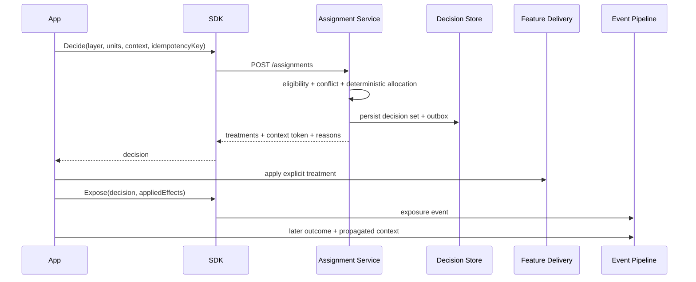

# Layered Experimentation Framework and Service

**Readiness:** Conditionally ready for a technical prototype; not ready for production implementation until the blocking SLO, identity, privacy, and analytical-ownership decisions in §15 are accepted.

The normative distributed-systems, causal-lineage, event-durability, and privacy semantics are defined in [Correctness contracts](correctness-contracts.md). An implementation must satisfy both documents; where this overview is less precise, the correctness contracts govern.

## 1. Decision summary

Build a domain-agnostic experimentation framework with a dedicated assignment service and small client SDK. The service—not a feature-flag provider—will own eligibility, deterministic treatment assignment, mutual exclusion, compatibility rules, immutable provenance, and assignment audit.

The design makes **assignment**, **exposure**, **applied effects**, and **outcomes** separate facts joined by a signed decision-context token. A layer represents a meaningful decision point or influence boundary. A layer may contain multiple mutually exclusive allocation namespaces; namespaces may overlap only through explicit compatibility rules. Every exposure records the concurrent assignment context needed to identify possible interactions.

The first implementation should target .NET while keeping HTTP, configuration, and event contracts language-neutral. LaunchDarkly or another flag system may deliver features after assignment, but it must not independently bucket experimental units.

### Decision required

Accept or revise:

1. the layer + effect + allocation-namespace model;
2. persisted first-assignment decisions with deterministic hashing as the recovery/replay mechanism;
3. explicit exposure and applied-effect logging;
4. the split between a dedicated control/data-plane service and a lightweight SDK;
5. the MVP boundary in §13.

## 2. Problem and evidence

### 2.1 Problem

When a feature-flag system also owns experiment eligibility and bucketing, the experiment definition becomes distributed across flag rules, application code, data models, and analytics queries. This is manageable for a few tests at one decision point, but degrades as experiments accumulate:

- it becomes difficult to know which experiment caused a selected behaviour;
- assignment may be recorded against one entity while bucketing uses another;
- the flag state visible today may not explain the decision made previously;
- multiple experiments can influence the same decision without a common conflict model;
- adding, removing, or reallocating experiments can unintentionally move subjects;
- assignment is often mistaken for actual treatment exposure;
- analysts must reconstruct concurrent experiments after the fact;
- application developers repeat bespoke integration and logging work.

### 2.2 Evidence from prior systems

The model is informed by primary engineering sources documented in [research.md](research.md):

- Google’s overlapping experiment infrastructure partitions changeable parameters into layers; a request may enter at most one experiment per layer while assignments across layers are independently salted. Google explicitly records trigger/counterfactual state and validates layer/traffic conflicts before launch.[R1]
- PlanOut separates experimental design from application logic, supports multiple assignment units, uses salted deterministic hashing, and treats namespaced traffic as a way to manage mutually exclusive experiments.[R4]
- LinkedIn’s hash-based assignment is local, deterministic, independent across experiments, and resilient to backend failure; assignment data is still recorded where attribution requires it. LinkedIn also detects pairwise experiment interactions and sample-ratio mismatch.[R6][R7]
- Netflix separated allocation rules, persisted member allocations, cached reads, and published allocation events for analysis. It allowed concurrent non-conflicting tests and surfaced possible conflicts to experiment owners.[R8]
- Google SRE’s canarying guidance warns that overlapping canaries contaminate signals, requires canary/control metrics to be distinguishable, and ties evaluation to rollback. Deployment canaries and product experiments are related controls but serve different decisions.[R2][R3]

### 2.3 Current assumptions

- The framework must support typed assignment units rather than assuming a single global user ID.
- Layers represent decision/influence points, not necessarily application components.
- Experiments on one layer may be exclusive or explicitly compatible.
- A later implementation will be .NET, but definitions and protocols must remain portable.
- Feature delivery may remain in LaunchDarkly, but assignment moves to this service.
- The governing model must not depend on any one business domain.

## 3. Stakeholders and audience

| Stakeholder | Need |
|---|---|
| Experiment author | Define hypotheses, units, eligibility, treatments, effects, metrics, and lifecycle without application bucketing code |
| Application engineer | Obtain a stable treatment and emit correct provenance with minimal integration code |
| Data scientist / analyst | Join outcomes to assignments and actual exposures; identify concurrent treatments and invalid experiments |
| Product owner | Know what changed, for whom, why, and whether guardrails were respected |
| Platform operator | Publish safe configurations, detect conflicts, observe service health, and recover from failure |
| Security/privacy reviewer | Ensure identifiers, attributes, payloads, retention, access, and audit are controlled |
| Auditor/support engineer | Reproduce the exact configuration, inputs, treatment, and applied effects behind a past decision |

## 4. Goals and non-goals

### 4.1 Goals

**G-01 — Attribution:** Every affected decision and later outcome can be associated with its experiment assignment, treatment, pinned configuration sequence, assignment unit, actual exposure, and concrete applied effects.

**G-02 — Ease of use:** The normal application integration is one assignment call followed by one post-effect exposure acknowledgement, with SDK propagation and merge of bounded decision-context manifests.

**G-03 — Isolation:** Introducing, stopping, or deleting one experiment does not alter assignments for unrelated running experiments.

**G-04 — Explicit overlap:** Experiments overlap only through declared layer, effect, namespace, and compatibility semantics.

**G-05 — Interaction visibility:** Data consumers can identify which assignments and exposures co-occurred for an outcome and can construct pairwise interaction analyses.

**G-06 — Multiple units:** Experiments may randomise users, sessions, accounts, devices, transactions, requests, composite keys, or registered custom unit types.

**G-07 — Auditability:** Historical decisions remain reproducible after configuration changes.

**G-08 — Safe operation:** Failure behaviour is explicit per layer or experiment and always resolves to a reviewed safe default.

**G-09 — Delivery separation:** Assignment can drive LaunchDarkly or another delivery mechanism without allowing that mechanism to rebucket the experimental unit.

### 4.2 Non-goals

- A complete statistical analysis product in the first release.
- A general feature-flag management replacement.
- A business-rule, policy, recommendation, pricing, or model-serving engine.
- Automatic discovery of all causal interference between arbitrary units.
- Automatic selection of experiment success metrics or launch decisions.
- Arbitrary code execution in experiment definitions.
- Retrofitting missing historical exposure data by assuming assignment equals exposure.
- Domain-specific product concepts in core protocols.

### 4.3 Success measures

Targets require owner approval; none are fabricated here.

| Outcome | Measure | Target |
|---|---|---|
| Attribution completeness | Proportion of applied experimental decisions with valid assignment, exposure, effect, and correlation provenance | `[BLOCKING: approved target]` |
| Integration effort | Median code/configuration changes for a standard experiment | `[BLOCKING: baseline and target]` |
| Assignment stability | Existing units whose unrelated assignments change after another experiment is added/removed | **Exactly zero by invariant** |
| Conflict prevention | Invalid overlapping configurations rejected before publication | **All deterministically detectable conflicts** |
| Decision reproducibility | Sampled historical decisions reproduced from revision + canonical inputs | `[BLOCKING: approved target]` |
| Service performance | Assignment latency and availability by integration mode | `[BLOCKING: SLO]` |
| Data quality | SRM, exposure mismatch, missing context, assignment churn, and duplicate-event alerts | `[BLOCKING: operating thresholds]` |

## 5. Conceptual model

### 5.1 Unit

A typed identifier used for eligibility or randomisation:

```json
{ "type": "account", "id": "opaque-123" }
```

An experiment declares exactly one **randomisation unit type**. It may consume additional context units for eligibility or later analysis.

A composite unit is canonical ordered data, for example:

```json
{
  "type": "viewer-item",
  "components": [
    { "type": "viewer", "id": "opaque-123" },
    { "type": "item", "id": "opaque-987" }
  ]
}
```

Unit type is part of the hash input. IDs must be opaque and must not contain raw PII.

### 5.2 Layer

A named decision point or influence boundary. Examples may include `presentation`, `ranking`, `eligibility`, `offer-construction`, or `fulfilment`, but the platform does not prescribe these names.

A layer defines:

- owners and description;
- permitted effect keys;
- supported randomisation unit types;
- default failure policy;
- allocation namespaces;
- cross-layer compatibility or review requirements.

A layer is semantically meaningful. It is not just a folder.

### 5.3 Effect

A stable, namespaced description of behaviour an experiment may alter, such as:

```text
presentation.checkout.sequence
ranking.home.algorithm
fulfilment.delivery.method
```

An experiment declares effect claims with a composition mode:

- `replace` — supplies the value; conflicts with another replacement;
- `add` — additive numeric/combinable effect under a registered reducer;
- `multiply` — multiplicative effect under a registered reducer;
- `append` — ordered composition under a registered contract;
- `observe` — reads/targets the effect but does not modify it.

Only registered deterministic composition operators are permitted. `replace` is the safe default.

### 5.4 Allocation namespace

A stable mutually exclusive allocation space within a layer. A namespace is bound to one randomisation unit type and one assignment epoch; a unit can enter at most one experiment in that namespace and epoch.

Experiments using different unit types require different namespaces. They may overlap only through explicit compatibility rules because mutual exclusion cannot be guaranteed across unrelated identities without a registered relationship/cluster resolver.

This separates two concepts that are often collapsed:

- **Layer:** where effects may interact.
- **Namespace:** which experiments compete for the same allocation slots.

Different namespaces in one layer may overlap only if their experiment pairs are explicitly compatible and their effect claims can compose.

### 5.5 Experiment and revision

An experiment is the durable identity and lifecycle. An **experiment revision** is an immutable definition containing:

- hypothesis and owner;
- layer and allocation namespace;
- randomisation unit;
- eligibility expression;
- variants and weights;
- effect claims and treatment payloads;
- compatibility/exclusion declarations;
- metrics and guardrails;
- failure policy;
- schedule and allocation slots;
- assignment algorithm/version;
- exposure contract;
- analysis unit and correlation requirements.

Changing any field creates an immutable definition revision. Assignment-affecting fields create a new assignment epoch; exposure/metric/estimand fields create a new analysis revision without rebucketing; namespace partition and allocation-map versions are separate. Mutable edits must not rewrite historical meaning. See [Correctness contracts §2](correctness-contracts.md#2-revision-and-epoch-taxonomy).

### 5.6 Assignment

An immutable decision that an eligible unit belongs to one experiment revision and variant. Assignment answers **what was chosen**, not whether the treatment was used.

### 5.7 Exposure

Evidence that a treatment influenced observable behaviour. Exposure records:

- decision context;
- exposure time and point;
- actual experiment/variant used;
- all relevant concurrently active assignments;
- applied effect values or stable hashes plus protected payload location;
- application/service version;
- idempotency key.

### 5.8 Outcome

A later event measured for analysis. Outcomes are domain-defined but use a common envelope containing event type, time, correlation units/keys, and decision-context token where available.

## 6. Requirements

### 6.1 Functional requirements

| ID | Requirement | Verification |
|---|---|---|
| FR-001 | Given the same canonical unit, experiment identity, assignment epoch, and algorithm version, the service must return the same candidate variant across metadata-only revisions. | Cross-process and cross-language golden vectors |
| FR-002 | The service must support registered scalar and composite randomisation units. | Contract tests over example unit types |
| FR-003 | An experiment must declare one layer, one allocation namespace whose bound unit type matches its randomisation unit, and at least one control and one treatment. | Schema and publication validation |
| FR-004 | The control plane must reject configurations with overlapping exclusive slots in the same namespace or experiments whose unit type differs from the namespace contract. | Property and integration tests |
| FR-005 | The control plane must reject eligible experiment pairs with incompatible effect claims unless an explicit reviewed override exists. | Conflict-matrix tests |
| FR-006 | Adding, stopping, or removing an experiment must not reassign units in unrelated active experiments. | Snapshot-diff property test over generated configurations |
| FR-007 | A caller must be able to request assignments for a named decision point and receive a decision-set ID, assignment details, treatment payloads, configuration sequence, and mergeable context-manifest token. | API contract tests |
| FR-008 | Repeating a request with the same idempotency key and canonical decision inputs must return the original persisted decision. | Idempotency integration test |
| FR-009 | The system must record assignment separately from exposure. | Storage/event contract inspection |
| FR-010 | The SDK must let callers record actual applied effects, not only intended treatment names. | SDK integration test |
| FR-011 | Exposure must include or resolve to the active assignment vector relevant to the decision. | Canonical dataset test |
| FR-012 | Outcome events must be joinable through explicit unit/correlation relationships and decision context; the platform must not rely on guessed identity joins. | End-to-end attribution fixture |
| FR-013 | A historical assignment must remain explainable from its minimized typed decision trace; full re-execution is required only while protected canonical inputs and relationship versions are retained. | Audit API and retention/deletion integration tests |
| FR-014 | Each layer or experiment must declare a safe failure policy. | Publication validation |
| FR-015 | The service must support previewing an assignment without recording exposure and simulating a definition against fixture units without allocating production subjects. | Preview/simulation tests |
| FR-016 | An experiment must transition through explicit lifecycle states and retain terminal history. | State-machine tests |
| FR-017 | Feature-delivery adapters must consume an explicit treatment; they must not independently randomise the unit. | Adapter contract tests |
| FR-018 | Configuration publication must produce an immutable, monotonically sequenced snapshot with both content checksum and publisher signature. | Digest, signature, rollback-protection, and key-rotation tests |
| FR-019 | For sticky experiments, concurrent or repeated first decisions for the same tenant, environment, experiment, assignment epoch, and canonical unit must resolve to one authoritative assignment regardless of request idempotency key. | Unique-constraint and concurrency integration tests |

### 6.2 Stability invariants

**INV-001 — Experiment isolation:** The variant hash salt contains experiment ID and assignment epoch, but not mutable metadata revision; another experiment’s lifecycle cannot affect it, and a metadata-only revision cannot rebucket it.

**INV-002 — Namespace slot stability:** Active experiments own explicit fixed slots. Adding or deleting another experiment never compacts or renumbers occupied slots.

**INV-003 — Historical immutability with lawful erasure:** Published revisions and event facts are never silently rewritten. Corrections are linked events; lawful deletion uses explicit tombstoning, relationship-map deletion, crypto-shredding, or irreversible aggregation and reports the resulting loss of replay evidence.

**INV-004 — No hidden overlap:** A decision may contain multiple assignments for one layer only when the complete simultaneously applicable set passes explicit compatibility, exclusion, unit, and effect-composition validation for that configuration sequence.

**INV-005 — No assignment-as-exposure:** Analysis datasets must not label a unit exposed without an exposure fact or an explicitly declared intent-to-treat analysis.

**INV-006 — Applied-fact provenance:** The persisted effect manifest reflects what the application used, even if later configuration changes.

**INV-007 — Canonical hashing:** Hash input serialization, algorithm, encoding, slot count, and salts are versioned and covered by golden vectors.

**INV-008 — Safe default:** Every evaluation path resolves to a safe non-experimental/default action when its declared failure policy requires fallback.

### 6.3 Quality requirements

| ID | Requirement | Verification |
|---|---|---|
| QR-001 | Assignment service latency must meet `[BLOCKING: approved percentile and workload SLO]`. | Load test at public API boundary |
| QR-002 | Assignment availability must meet `[BLOCKING: approved SLO]`, with layer-specific fallback tests. | Fault injection and SLO evidence |
| QR-003 | Configuration propagation must meet `[BLOCKING: freshness target]`, and responses must expose the revision used. | Publication-to-evaluation integration test |
| QR-004 | Event ingestion must be at-least-once and consumers must deduplicate by stable event ID. | Duplicate/reordering tests |
| QR-005 | The system must detect configuration drift, assignment churn, SRM, unexpected overlap, and exposure/assignment mismatch. | Data-quality fixture suite |
| QR-006 | Core APIs and SDKs must expose structured reason codes and trace correlation. | Contract and telemetry review |
| QR-007 | The common integration path must not require application-owned bucketing, hashing, or experiment-join logic. | Worked integration review |

### 6.4 Security and privacy requirements

| ID | Requirement | Verification |
|---|---|---|
| SEC-001 | Core records must use tenant/environment-scoped tokenised or keyed pseudonymous subject IDs and prohibit raw direct identifiers in unit IDs or free-form attributes; opaque stability is still treated as personal/pseudonymous data. | Schema, cross-environment isolation, and security tests |
| SEC-002 | Eligibility attributes must use an allow-listed typed schema with classification and retention policy. | Publication validation |
| SEC-003 | Decision-context tokens must bind tenant, environment, issuer, audience, schema, decision point, manifest, validity, and key ID; ingestion must authorise the producer and correlation-unit reference. | Tamper, replay, cross-scope, key-rotation, and payload inspection tests |
| SEC-004 | Definition authoring, approval, publication, pause, and override actions must be authorised and audited. | RBAC and audit tests |
| SEC-005 | Sensitive effect values must be stored under access controls; analytics may use stable hashes or classified projections. | Data-access review |
| SEC-006 | Logs and telemetry must not contain raw identifiers, secrets, or unrestricted eligibility payloads. | Automated log scanning |
| SEC-007 | Retention, lawful deletion, residency, consent/opt-out where applicable, and key-rotation/crypto-shredding rules must apply independently to definitions, decisions, exposures, outcomes, and subject relationships; any resulting loss of replay must be reported. | Retention, erasure, residency, and audit-degradation workflow tests |

## 7. Allocation and overlap semantics

### 7.1 Fixed slot map

Each allocation namespace has a fixed-size versioned slot space. The exact slot count is an implementation choice; changing it creates a new namespace partition epoch and a reviewed namespace-wide migration.

```text
namespace_slot = Hash(namespace_salt, namespace_partition_epoch, unit_type, canonical_unit) mod slot_count
```

Experiments receive explicit slot sets with effective ownership intervals. The control plane does not compact the map when an experiment ends. Freed slots may be reallocated only after any required carryover washout/quarantine; active ownership and other experiment assignments never move implicitly.

Within an allocated experiment:

```text
variant_value = Hash(experiment_salt, experiment_id, assignment_epoch, canonical_unit)
variant = map_to_weight_interval(variant_value)
```

Changing variant weights may reassign units. Therefore weight changes that affect a running experiment must create a new assignment epoch, show a churn preview, and require review. Metadata-only revisions preserve the epoch and do not enter the variant hash. Any slot-set expansion/shrinkage also creates a new assignment epoch for that experiment; other slot owners remain unchanged. Slot ownership has effective intervals, and freed slots may require a washout/quarantine interval before reuse. Changing namespace unit, slot count, canonicalisation, hash, or salt creates a separate namespace partition epoch and is a high-impact migration.

### 7.2 Eligibility

Eligibility is evaluated before a unit’s first assignment in an experiment epoch and is versioned with the revision. It may use allow-listed context attributes and unit relationships.

The default persistence mode is `sticky-while-active`: once assigned, the same canonical unit returns its existing assignment for that experiment epoch even if mutable eligibility attributes later change. This preserves a coherent treatment history. Experiments that need per-operation eligibility must choose an operation/request-like randomisation unit or a separately reviewed dynamic-trigger design; they must not silently re-evaluate a long-lived unit into and out of the cohort.

The assignment store therefore enforces one authoritative assignment for `(experiment, assignment epoch, canonical unit hash)`, independently of request idempotency keys. A new eligibility definition creates a revision; changing the cohort of already-assigned units requires a new assignment epoch and separate analysis.

Eligibility and treatment assignment must be distinguishable in the audit result:

```text
not_considered | ineligible | namespace_miss | excluded | assigned_control | assigned_treatment | fallback
```

Eligibility changes can alter the observed population. They therefore create a new revision and must be visible in analysis.

### 7.3 Same-layer overlap

The safe default is mutual exclusion inside an allocation namespace. Experiments in different namespaces in the same layer may overlap only when the **complete simultaneously applicable set**, not merely each pair:

1. has mutual compatibility or an approved set-level composition policy;
2. has disjoint effects or registered reducers with defined types, identity, associativity, commutativity/ordering, error behaviour, and version;
3. matches no exclusion rule;
4. resolves to one deterministic composition independent of discovery order;
5. has an analysis plan acknowledging possible interaction.

Two `replace` claims on the same effect are invalid without an explicit versioned composition contract. Eligibility uses a restricted DSL whose static intersection result is `proven-disjoint`, `may-overlap`, or `invalid`; `may-overlap` is conservatively treated as overlap.

A broad experiment that changes many effects should use an exclusive namespace or explicitly exclude narrower experiments.

### 7.4 Cross-layer overlap

Different layers are assigned with independent salts. Statistical independence of assignment does **not** prove absence of treatment interaction. The platform records co-exposure so analysis can test important pairwise interactions.

### 7.5 Conflict checks

Publication checks include:

- duplicate experiment, revision, layer, namespace, effect, metric, and unit identifiers;
- slot collision;
- unsupported unit type;
- missing control;
- invalid weights;
- overlapping eligibility with incompatible effects;
- exclusion cycles or unreachable treatments;
- unregistered composition operator;
- missing safe default;
- missing exposure point or required correlation units;
- insufficient allocation for the declared analysis plan where sizing integration exists;
- concurrent deployment canaries when policy prohibits signal contamination.

## 8. Assignment, exposure, and outcome flow



### 8.1 Why persist decisions if hashing is deterministic?

Deterministic hashing provides reproducibility and local recovery, but persistence records facts that hashing alone cannot:

- the minimized typed predicate, relationship, allocation, and composition trace observed under the pinned configuration sequence;
- which exclusions and compatibility rules ran;
- whether fallback occurred;
- configuration propagation state;
- idempotent decision reuse;
- the context token attached to downstream behaviour.

The initial design therefore persists authoritative first decisions. A later high-scale local-first mode is permitted only with equivalent provenance, bounded allocation authority/lease, globally reconciled assignment uniqueness, and revocation semantics defined in the correctness contracts.

### 8.2 Exposure timing

An exposure should be emitted at the narrowest point where treatment can affect behaviour—not when configuration is fetched. The API supports:

- `assign` followed by an application acknowledgement emitted only after the effect point succeeds;
- counterfactual/trigger events where both control and treatment eligibility at the effect point must be measured.

A remote service cannot atomically prove application exposure. Convenience helpers may prepare an envelope, but must not emit it before the caller confirms actual use.

### 8.3 Decision-context propagation

The service returns a signed compact token referencing an immutable server-side context manifest:

```json
{
  "v": 1,
  "tenant": "tenant-id",
  "environment": "production",
  "decisionPoint": "checkout",
  "contextManifestId": "ctx_...",
  "configurationSequence": 123,
  "issuedAt": "...",
  "treatmentValidUntil": "...",
  "issuer": "experimentation-service",
  "audience": "application-and-event-ingestion",
  "keyId": "..."
}
```

A context manifest can reference multiple parent manifests, decision sets, assignments, and exposures. SDKs merge by verified tenant/environment, canonical union, deduplication, and stable ordering; bounded tokens spill to server-side manifests. Missing or truncated lineage is explicit data-quality state.

Applications propagate the token through request context and domain events. It carries identifiers only and links to protected server-side records.

Treatment validity and correlation validity are separate. An expired decision must not authorise a new exposure, but its signed identifiers may still correlate a later outcome within retention. Event ingestion validates signature, key history, event time, and referenced decision without treating the token as an authorisation credential. Signing keys and lookup records must be retained long enough for the longest supported outcome window.

### 8.4 Applied-effect manifest

The exposure records the concrete behaviour used:

```json
{
  "effects": [
    {
      "key": "presentation.checkout.sequence",
      "mode": "replace",
      "valueRef": "checkout-v3",
      "valueHash": "sha256:...",
      "provider": "launchdarkly",
      "providerRevision": "..."
    }
  ]
}
```

This closes the gap between “assigned variant A” and “the system actually used component/configuration X.”

## 9. Feature-delivery integration

LaunchDarkly remains a delivery mechanism, not the experiment authority.

Permitted patterns:

1. **Direct payload:** Assignment treatment contains typed configuration consumed by application code.
2. **Explicit variation:** Assignment treatment names a LaunchDarkly variation or prerequisite; the adapter requests that exact delivery path without independent percentage rollout.
3. **Assignment context:** The adapter passes a non-sensitive assignment key to a flag configured for exact targeting, never percentage bucketing.

The adapter records flag key, returned variation, and flag/config revision in the applied-effect manifest. If delivery disagrees with assignment, the system always persists both intended and actual effects as an immutable mismatch fact, marks it invalid for primary analysis, and raises a data-quality alert. It never rejects or discards the evidence.

## 10. Failure semantics

Each layer defines a reviewed default; an experiment may choose a stricter compatible policy.

| Policy | Behaviour |
|---|---|
| `safe-default` | Use the non-experimental default and record fallback |
| `cached-decision` | Reuse a previously persisted decision within declared validity |
| `cached-configuration` | Evaluate locally from an approved signed snapshot only when the layer has an explicit local-first lease/authority contract; otherwise it cannot create a first sticky assignment |
| `fail-closed` | Stop the affected operation rather than proceed without an authoritative assignment |
| `control-only` | Force the control treatment and record fallback |

Every policy defines:

- maximum configuration/decision staleness;
- whether first-time units may be assigned offline;
- required event once connectivity returns;
- treatment for malformed context;
- caller-visible reason code;
- operational alerting threshold.

Silent random fallback is forbidden. A fallback response—including `control-only`—is a non-random operational fact, not an ordinary control assignment, and must be excluded or separately modelled in causal analysis.

## 11. Canonical data products

The event stream produces append-only canonical tables or equivalent views:

### `experiment_assignment`

One row per assignment decision: tenant/environment, unit token, layer, namespace, experiment/revision/epochs, variant, slot, minimized typed decision-trace reference, reasons, configuration sequence, failure mode, and timestamps. Eligibility hashes alone are not replay evidence; protected inputs/relationship versions are retained only according to classification and deletion policy.

### `experiment_exposure`

One row per actual effect point: assignment ID, exposure point, active assignment vector/fingerprint, applied-effect manifest, application version, event time.

### `experiment_outcome`

One row per domain outcome envelope: event type, analysis units, explicit correlations, decision context, event time, schema version.

### `experiment_attribution`

A derived, versioned join explaining which assignments and exposures are eligible for each outcome under a named attribution rule. The rule version is mandatory; derived attribution must never overwrite raw facts.

### `experiment_interaction_context`

A co-exposure dataset keyed by outcome/exposure with sorted experiment-revision/variant vectors. It supports pairwise interaction reports and reveals when unexpected combinations occurred.

## 12. Lifecycle and governance

```text
draft → validated → approved → scheduled → running → paused → completed → archived
                      ↘ rejected        ↘ cancelled
```

- Definitions are editable only in `draft`.
- Validation produces conflict, churn, sizing, and schema reports.
- Approval names accountable product, engineering, and analytical owners as required by risk.
- Publication creates an immutable revision and signed configuration snapshot.
- Emergency pause stops new assignments and exposures according to policy but retains history. Existing assignment facts remain immutable; they do not grant permission to apply treatment after the revision’s exposure window closes.
- Decision/token validity must not outlive the applicable exposure window unless the layer explicitly supports a revocation mechanism and bounded cached use.
- Completion does not delete slots or records.
- A winning treatment becomes a normal product/configuration default through a separate launch action; experiments are not permanent feature configuration.
- Forgotten/expired experiments alert owners and can stop assigning after a reviewed expiry policy.

### Experiment-readiness checklist

Before `running`:

- hypothesis and decision are clear;
- randomisation and analysis units are compatible;
- layer, namespace, effect claims, and overlaps are reviewed;
- eligibility and trigger/exposure semantics are defined;
- control reflects the current default;
- primary, secondary, guardrail, and data-quality metrics are named;
- sizing/power review is complete where causal analysis is expected;
- assignment and outcome identity joins are demonstrated with fixtures;
- safe failure, pause, and rollback behaviour is tested;
- SRM and exposure validation are enabled;
- owner and expiry are set.

## 13. MVP and staged delivery

### Phase 0 — Executable specification

- JSON schemas and golden assignment vectors.
- In-memory reference allocator.
- Conflict/effect validator.
- Property tests for stability and overlap.
- Generic example definitions.

### Phase 1 — Assignment and provenance MVP

- .NET control/data-plane service.
- PostgreSQL or equivalent authoritative store, selected by ADR.
- Definition/revision/lifecycle API.
- Fixed-slot allocator and persisted decisions.
- .NET SDK with context propagation.
- Assignment, exposure, and outcome event envelopes.
- Audit/explain endpoint.
- Signed configuration snapshots.

### Phase 2 — Operational integrations

- LaunchDarkly delivery adapter.
- Cached/snapshot evaluation mode.
- Outbox/event-stream integration.
- Data-quality checks: SRM, churn, assignment/exposure mismatch, unexpected overlap.
- Canonical warehouse models.
- Experiment preview and fixture simulator.

### Phase 3 — Workflow and analysis

- Self-service authoring UI.
- Conflict and schedule visualisation.
- Metric registry and sizing integration.
- Pairwise interaction reporting.
- Guardrail monitoring, automatic pause hooks, and experiment knowledge repository.

## 14. Alternatives considered

| Alternative | Advantages | Disadvantages | Outcome |
|---|---|---|---|
| Keep all assignment in LaunchDarkly | Lowest initial build cost | Continues distributed provenance, domain modelling, and interaction limitations | Rejected as target architecture; supported for migration only |
| SDK-only deterministic framework | Lowest latency and strong availability | Harder authoritative audit, config governance, first-decision idempotency, and central conflict control | Retain as optional cached evaluation mode, not sole authority |
| Service-only persisted RNG allocation | Simple conceptual audit | Network/storage dependency on every first decision; replay and cross-language consistency weaker | Rejected as default |
| One global mutually exclusive layer | Easy analysis and no overlap | Severe traffic starvation and poor scale | Rejected |
| Fully independent per-experiment hashing | Easy concurrency | No built-in mutual exclusion or protection against conflicting effects | Rejected without namespaces/effect validation |
| Google-style one experiment per layer only | Strong isolation and proven model | User’s layer concept is broader than parameter partition; legitimate same-layer compatible tests need subspaces | Adapted through allocation namespaces and effect claims |
| Full factorial interaction model | Explicit combinations | Combinatorial complexity and poor usability at scale | Supported only as an explicitly authored design, not default |
| Assignment equals exposure | Simple logs | Biased triggered analysis and false attribution | Rejected |

## 15. Risks, assumptions, and open questions

### 15.1 Risks

| Risk | Mitigation |
|---|---|
| Layer/effect taxonomy becomes bureaucracy | Start with few meaningful layers; allow versioned evolution; measure rejected/confusing definitions |
| Compatibility declarations hide real interactions | Record complete co-exposure context; pairwise checks; require explicit high-risk exclusions |
| Assignment service becomes critical-path dependency | Signed snapshot/cache modes, per-layer failure policy, SLOs, load/fault tests |
| Persisting decisions increases scale and sensitive-data footprint | Opaque IDs, minimised snapshots/hashes, retention tiers, outbox/batching, later sampled/local mode only with equivalent provenance |
| Eligibility changes bias populations | Immutable revisions, pre-period/A/A checks, SRM monitoring, analysis by revision |
| Hash or serialization change causes mass churn | Versioned canonical serialization, golden vectors, churn preview, migration epoch |
| Different assignment and outcome units create invalid joins | Registered relationship contracts and fixture-based attribution validation |
| Interaction testing creates multiple-comparison noise | Predeclare important interactions; label exploratory reports; use statistical review |
| Feature delivery differs from assigned treatment | Applied-effect manifest and mismatch alert |
| Experiment becomes permanent configuration | Expiry, owner alerts, explicit launch-to-default process |

### 15.2 Blocking production decisions

- `[BLOCKING]` Assignment latency, availability, and configuration-propagation SLOs.
- `[BLOCKING]` Default persistence and retention periods for decision/exposure/outcome records.
- `[BLOCKING]` Identity registry and rules for joining units across lifecycle stages.
- `[BLOCKING]` Authorisation roles and approval policy.
- `[BLOCKING]` Event transport and canonical warehouse/storage integration.
- `[BLOCKING]` Statistical/analytical owner and minimum metric/sizing/SRM policy.
- `[BLOCKING]` Whether any layer may enable leased local first assignment; the default is prohibited, and each exception requires maximum revocation delay.
- `[BLOCKING]` Treatment payload classification and storage rules.
- `[BLOCKING]` Numeric limits for request cardinality, payload/event/token/manifest size, eligibility cost, composition participants, buffers, retries, and late-event windows.

### 15.3 Delegated technical investigations

- Benchmark persisted-first-decision versus locally evaluated/outbox modes.
- Compare PostgreSQL, event-sourced, and hybrid decision stores against expected scale.
- Define canonical JSON or binary serialization and publish golden vectors.
- Prototype effect-claim validation and configuration churn diffing.
- Prototype LaunchDarkly exact-delivery adapter without secondary bucketing.

## 16. Verification plan

| Requirement area | Evidence |
|---|---|
| Determinism | Golden vectors across .NET processes and an independent reference implementation |
| Isolation | Property test: arbitrary add/remove/reorder of unrelated definitions does not change existing assignments |
| Conflict safety | Generated layer/namespace/effect graphs accepted or rejected according to compatibility rules |
| Idempotency | Concurrent requests with different idempotency keys and regions resolve to one tenant/environment/experiment/epoch/unit assignment and one atomic decision set |
| Configuration consistency | Stale sequence, rollback-as-new-sequence, revocation tombstone, leased-local reconciliation, and split-brain fixtures |
| Historical audit | Explain sampled decisions from retained typed traces; verify explicit degraded result after protected evidence deletion |
| Exposure correctness | Assigned-but-unexposed fixture remains unexposed; post-effect acknowledgement and immutable delivery-mismatch facts are verified |
| Attribution | Fan-out/fan-in context manifests, multiple decision sets, truncation, and time-versioned unit relationships join only by declared precedence |
| Interactions | Assignment, trigger, and co-exposure fixtures enforce estimability, cell/SRM, temporal, unit, power, and multiplicity status |
| Delivery | LaunchDarkly adapter records actual variation and catches mismatch |
| Failure | Multi-region partition, database/event/key-service outage, clock skew, stale/corrupt snapshot, revocation lag, late events, relationship deletion, and each fallback policy without silent rebucketing |
| Privacy/security | Schema fuzzing, cross-tenant/environment isolation, token tamper/replay/scope/key-rotation, lawful erasure, keyed-digest inspection, RBAC, and log scans |
| Operations | Load, staleness, drift, duplicate/reordering, event-loss, and recovery tests |

## 17. Implementation slices

Implementation remains gated by the blocking decisions, but the safe order is:

1. **SPEC-01 — Contracts:** Finalise vocabulary, JSON schemas, state machine, canonical serialization, and golden vectors.
2. **CORE-01 — Allocator:** Build deterministic fixed-slot and variant allocator with property tests.
3. **CORE-02 — Validator:** Build layer/namespace/effect compatibility and churn-preview engine.
4. **SERVICE-01 — Control plane:** Definition, revision, validation, approval, snapshot, and audit APIs.
5. **SERVICE-02 — Decision path:** Idempotent assignment service, persistence, reason codes, and outbox.
6. **SDK-01 — .NET integration:** Typed units, assignment API, context propagation, exposure helper, safe fallback.
7. **DATA-01 — Event contracts:** Assignment, exposure, outcome, and relationship envelopes with deduplication.
8. **DATA-02 — Canonical models:** Attribution and interaction datasets plus quality checks.
9. **ADAPTER-01 — Delivery:** LaunchDarkly explicit-treatment adapter and mismatch telemetry.
10. **OPS-01 — Production readiness:** SLOs, dashboards, alerts, runbooks, fault/load tests, rollout and rollback.

## 18. References

See [research.md](research.md) for source notes and exact URLs.
